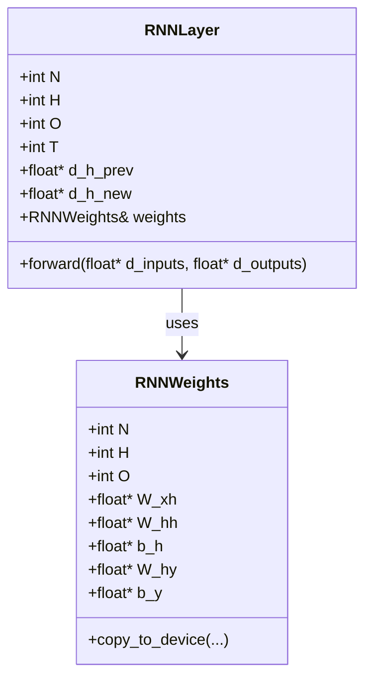

## Learning summary

* Implemented simple RNN operation

Given:

$$
x_t \in \mathbb{R}^n
$$

$$
h_t \in \mathbb{R}^h
$$

$$
y_t \in \mathbb{R}^o
$$

**Update rule**:

$$
h_t = \tanh(W_{xh} x_t + W_{hh} h_{t-1} + b_h)
$$

$$
y_t = W_{hy} h_t + b_y
$$

* Learned How to Debug with ``cuda-gdb``

### Code structure

